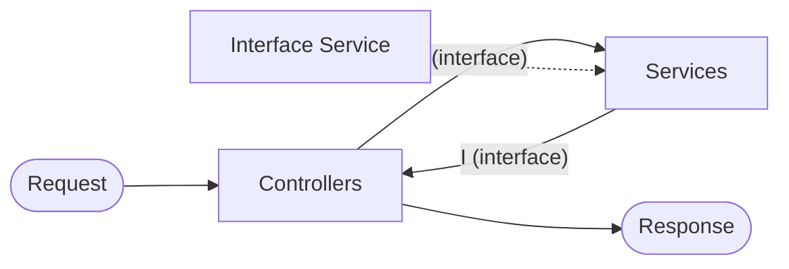

---
tags:
  - csharp
  - inyeccion-de-dependencia
  - arquitectura
---

# Capa de servicio (Service Layer)

Ver también: [[01-controladores|controladores]], [[03-interfaces|interfaces]]

## Flujo



El controller no habla directo con la clase concreta del service — habla con su **interface** (`IUsuarioService`). Misma idea que [[03-interfaces|interfaces]]: el controller depende del contrato, no de la implementación.

## Qué es

Capa intermedia entre el **controller** y el **acceso a datos** (DB, APIs externas, etc) — contiene la **lógica de negocio** de la aplicación. El controller no hace el trabajo pesado, delega en el servicio.

Interface (el contrato):

```csharp
public interface IUsuarioService
{
    Usuario ObtenerUsuario(int id);
}
```

Implementación concreta:

```csharp
public class UsuarioService : IUsuarioService
{
    public Usuario ObtenerUsuario(int id)
    {
        // lógica de negocio: buscar en DB, validar, transformar, etc
        return new Usuario { Id = id, Nombre = "Facundo" };
    }
}
```

Controller — depende de la **interface**, no de `UsuarioService`:

```csharp
[ApiController]
[Route("api/[controller]")]
public class UsuariosController : ControllerBase
{
    private readonly IUsuarioService _usuarioService;

    public UsuariosController(IUsuarioService usuarioService)
    {
        _usuarioService = usuarioService;
    }

    [HttpGet("{id}")]
    public IActionResult Get(int id)
    {
        var usuario = _usuarioService.ObtenerUsuario(id);
        return Ok(usuario);
    }
}
```

El controller solo recibe el request, llama al servicio, y arma la respuesta (`Ok`, `NotFound`, etc) — no sabe *cómo* se obtiene el dato, solo *qué* pedir. Tampoco sabe qué clase implementa `IUsuarioService` — eso lo resuelve el contenedor de DI en runtime.

## Registrar el service en `Program.cs`

Para que el controller pueda recibir `IUsuarioService` inyectado, hay que **registrarlo** en el contenedor de DI antes de `builder.Build()` — ver [[01-inyeccion-de-dependencia]]:

```csharp
var builder = WebApplication.CreateBuilder(args);

builder.Services.AddControllers();
builder.Services.AddScoped<IUsuarioService, UsuarioService>();   // <- acá

var app = builder.Build();
```

Sin esta línea, ASP.NET Core no sabe qué instancia crear cuando un controller pide `IUsuarioService` en el constructor — tira error en runtime al armar el controller.

## Por qué se usa — separación de responsabilidades

Sin capa de servicio, toda la lógica (queries, validaciones, reglas de negocio) queda mezclada dentro del controller — difícil de mantener y de testear.

| | Controller | Service |
|---|---|---|
| Responsabilidad | recibir request, devolver response HTTP | lógica de negocio |
| Sabe de HTTP | sí (status codes, routing) | no |
| Sabe de reglas de negocio | no (o mínimo) | sí |

## Importancia

- **Testeable**: se puede testear la lógica de negocio (`UsuarioService`) sin levantar un servidor HTTP ni mockear requests
- **Reutilizable**: el mismo servicio se puede usar desde varios controllers, o desde otro contexto (un job, otro proceso)
- **Mantenible**: cambios en la lógica de negocio no tocan el controller, y viceversa
- **Desacoplado**: el controller no depende de los detalles de implementación (DB, APIs externas) — eso lo maneja el service (y más abajo, el repository/acceso a datos)

## Resumen

- Service layer = lógica de negocio, entre el controller y el acceso a datos
- Controller delega en el service, no hace el trabajo pesado él mismo
- Separar en capas = testeable, mantenible, reutilizable
