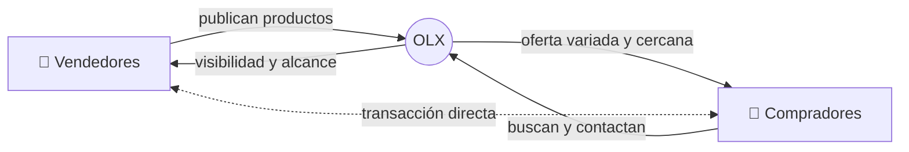
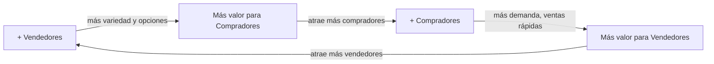

# Ejercicio: Análisis de Plataforma - OLX

## Parte A - Componentes (Multilateralidad e Intercambio de Valor)

### Dos o más partes

OLX conecta principalmente **dos lados**:

- **Lado A - Vendedores**: personas que quieren vender productos usados o nuevos (muebles, electrónica, vehículos, inmuebles, etc.)
- **Lado B - Compradores**: personas que buscan productos a menor precio o de segunda mano

> [!note] Los roles son intercambiables
> Un usuario puede ser vendedor en una transacción y comprador en otra. No hay roles fijos.

### Cómo facilita el intercambio de valor

OLX facilita un **intercambio transaccional** (producto x dinero) entre las partes:

- Proporciona un **marketplace** donde los vendedores publican avisos con fotos, descripción y precio
- Ofrece **búsqueda y filtros** (por categoría, ubicación, precio) para que los compradores encuentren lo que necesitan
- Brinda un **sistema de mensajería** para que comprador y vendedor coordinen la transacción
- Permite **geolocalización** para encontrar productos cercanos

### Valor externo que se crea

- **Ecosistema de reutilización**: se extiende la vida útil de productos, generando valor ambiental (economía circular)
- **Dinamización de la economía local**: facilita el comercio entre vecinos y dentro de ciudades, moviendo dinero en la economía informal/local
- **Referencia de precios**: la plataforma se convierte en una referencia de cuánto vale un producto usado en el mercado
- **Emprendedores**: muchas personas usan OLX como canal para iniciar pequeños negocios sin necesidad de un local físico

## Parte B - Creación de Valor (Modelo lineal vs. Modelo de plataforma)

### Cómo sería OLX con lógica lineal

Si OLX operara con **modelo lineal**, funcionaría como una **casa de empeño o consignación digitalizada** (tipo Cash Converters pero online):

- OLX **tasaría y compraría** los productos usados a los vendedores a un precio fijo según categoría y estado
- Realizaría un **control de calidad** propio (verificación, fotos estandarizadas, garantía de funcionamiento)
- Almacenaría el **inventario** en depósitos propios
- **Vendería mediante subasta**: en vez de precio fijo, OLX publicaría los productos en un sistema de **subasta con precio base** donde los compradores pujan. Esto maximiza el precio de venta y genera urgencia/competencia entre compradores
- **Entregaría** directamente al consumidor final con garantía OLX

El diferencial frente a un e-commerce tradicional sería doble: por un lado, la especialización en **productos de segunda mano con garantía y verificación** (producto verificado, garantía de devolución, fotos reales). Por otro, el **modelo de subasta** que genera competencia entre compradores y permite que el mercado determine el precio real del producto usado, algo que un retail con precio fijo no logra.

Es decir: mercado de un solo lado, valor lineal, valor interno.

### Qué cambia con la lógica de plataforma

Si comparamos con el modelo lineal que planteamos arriba, lo que cambia es:

- **Ya no se necesita capital para comprar stock**: OLX deja de invertir dinero en adquirir productos. El vendedor publica solo, OLX no pone un peso
- **Se elimina toda la operación física**: no hay más tasadores, depósitos, fotógrafos ni logística. Todo el costo operativo desaparece
- **La confianza se genera distinto**: en vez de que OLX garantice cada producto con verificación propia, son los usuarios quienes se califican entre sí. Se pierde el control pero se gana escala
- **Se pierde el modelo de subasta**: ya no hay pujas controladas por OLX. Cada vendedor pone su precio y negocia directo con el comprador. Se pierde la maximización de precio pero se gana velocidad
- **El catálogo deja de tener límite**: en el modelo lineal solo se puede vender lo que OLX compró. Ahora cualquier persona publica lo que quiera, cuando quiera
- **El valor deja de ser interno**: en el modelo lineal, OLX captura todo el margen. Con plataforma, el valor se distribuye entre todos los participantes y crece con cada usuario nuevo

| Aspecto         | Modelo Lineal (compra-venta)              | Modelo Plataforma (OLX real)                 |
| --------------- | ----------------------------------------- | -------------------------------------------- |
| **Mercado**     | Un solo lado (OLX le vende al consumidor) | Multi-lado (vendedor ↔ comprador)            |
| **Valor**       | Lineal (compro barato, vendo caro)        | De red (más usuarios = más valor para todos) |
| **Inventario**  | OLX necesita depósitos, stock, logística  | No tiene inventario, costo marginal ~cero    |
| **Escala**      | Limitada por capital y espacio físico     | Prácticamente ilimitada                      |
| **Precios**     | Los fija OLX                              | Los fija el mercado (oferta y demanda)       |
| **Riesgo**      | OLX asume riesgo de stock no vendido      | El riesgo lo asume el vendedor               |
| **Crecimiento** | Requiere más inversión por cada producto  | Cada usuario nuevo agrega valor sin costo    |

### Ventajas y riesgos: Modelo Lineal (OLX como casa de subasta/consignación)

**Ventajas:**
- **Confianza garantizada**: OLX verifica cada producto, el comprador sabe que lo que compra funciona y tiene garantía. Esto elimina el miedo a la estafa
- **Experiencia curada**: fotos profesionales, descripciones estandarizadas, productos en buen estado. El comprador tiene una experiencia premium
- **Subasta maximiza valor**: el vendedor obtiene el mejor precio posible porque los compradores compiten entre sí. OLX también maximiza su margen
- **Márgenes predecibles**: OLX compra a precio bajo y revende a precio de subasta. El negocio es financieramente controlable

**Riesgos:**
- **Capital intensivo**: OLX necesita dinero para comprar productos antes de venderlos. Si un celular no se vende en subasta, queda como pérdida
- **Escala limitada**: solo puede vender lo que cabe en sus depósitos. Expandirse a otra ciudad requiere abrir un nuevo centro de operaciones
- **Catálogo reducido**: solo puede ofrecer lo que compró. Si nadie le vende sillas, no hay sillas en la plataforma
- **Costos operativos altos**: tasadores, depósitos, logística, fotografía, devoluciones. Cada producto tiene un costo fijo antes de generar ingreso
- **Lentitud**: el ciclo compra → verificación → fotografía → subasta → entrega es lento comparado con una publicación instantánea

### Ventajas y riesgos: Modelo Plataforma (OLX real)

**Ventajas:**
- **Costo marginal ~cero**: agregar un vendedor o comprador más no le cuesta nada a OLX. No hay inventario, no hay depósitos
- **Catálogo infinito**: cualquier persona puede publicar cualquier cosa en cualquier momento. La variedad es incomparablemente mayor
- **Escala instantánea**: para llegar a una nueva ciudad solo necesita usuarios, no infraestructura física
- **Efectos de red**: cada usuario nuevo hace la plataforma más valiosa para todos los demás. El crecimiento se retroalimenta solo
- **Velocidad**: un vendedor puede publicar y tener compradores interesados en minutos
- **Monetización flexible**: publicaciones destacadas, publicidad, datos. No depende de un margen fijo por producto

**Riesgos:**
- **Problema del huevo y la gallina**: sin vendedores no vienen compradores, y sin compradores no vienen vendedores. Arrancar es el mayor desafío
- **Fraude y estafas**: OLX no verifica los productos. Pueden publicarse productos falsos, robados o en mal estado. La confianza depende de la comunidad
- **Calidad inconsistente**: cada vendedor describe y fotografía como quiere. La experiencia de compra es impredecible
- **Sin garantía**: si el producto no funciona, el comprador no tiene a quién reclamarle (OLX no es responsable)
- **Dependencia de la masa crítica**: si los usuarios migran a otra plataforma (ej: Facebook Marketplace), el valor colapsa rápidamente
- **Moderación difícil**: con millones de publicaciones, controlar contenido inapropiado, spam o fraude requiere inversión constante en tecnología

## Parte C - Efectos de Red

### Efectos de red directos

**Débiles en OLX**. Que haya más compradores no beneficia directamente a otros compradores (de hecho, compiten por el mismo producto). Lo mismo con vendedores entre sí.

> [!warning] Efecto directo negativo
> Más vendedores del mismo producto → mayor competencia → bajan los precios (negativo para vendedores). Más compradores del mismo producto → se agota más rápido (negativo para compradores tardíos).

### Efectos de red indirectos (cross-side)

**Muy fuertes en OLX**. Son el motor principal de la plataforma:

- **Más vendedores → más valor para compradores**: mayor variedad de productos, más opciones, mejores precios por competencia
- **Más compradores → más valor para vendedores**: más probabilidad de vender rápido, pueden pedir mejores precios por la demanda

> [!tip] Ciclo virtuoso
> Este es el **flywheel** de OLX: más vendedores atraen más compradores, que a su vez atraen más vendedores. El desafío es arrancar este ciclo (problema del huevo y la gallina).

### Efectos de red positivos vs. negativos

| | Positivos | Negativos |
|---|---|---|
| **Para compradores** | Más variedad, mejores precios, más opciones cercanas | Saturación de publicaciones repetidas, spam, productos falsos |
| **Para vendedores** | Mayor audiencia, ventas más rápidas | Más competencia, guerra de precios, compradores que no son serios |
| **Para la plataforma** | Más transacciones, más ingresos por destacados | Difícil moderar millones de publicaciones, fraude, pérdida de confianza |

> [!important] Congestión
> A medida que OLX crece, aparece el problema de **congestión**: demasiadas publicaciones de baja calidad dificultan encontrar buenos productos. Por eso OLX implementa publicaciones destacadas (pagas) y algoritmos de ranking para combatir este efecto negativo.
