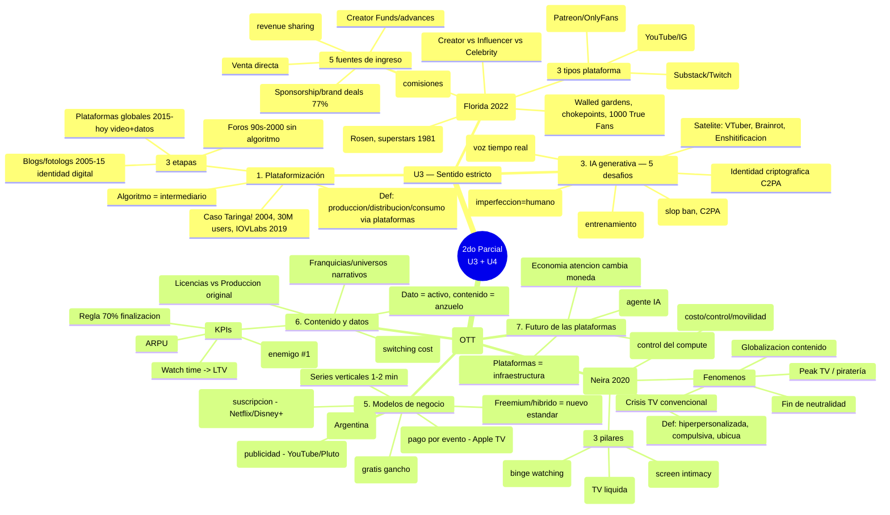

# Diagrama 2do Parcial — U3 + U4

Mapa de todos los temas y subtemas. Versión Excalidraw (nivel superior, visual): [[diagrama-2do-parcial.excalidraw]].

```mermaid
mindmap
  root((2do Parcial<br/>U3 + U4))
    U3 — Sentido estricto
      1. Plataformización
        Def: produccion/distribucion/consumo via plataformas
        Algoritmo = intermediario
        3 etapas
          Foros 90s-2000 sin algoritmo
          Blogs/fotologs 2005-15 identidad digital
          Plataformas globales 2015-hoy video+datos
        Caso Taringa! 2004, 30M users, IOVLabs 2019
      2. Creator Economy (Florida 2022)
        Creator vs Influencer vs Celebrity
        Winner-take-all (Rosen, superstars 1981)
        5 fuentes de ingreso
          Sponsorship/brand deals 77%
          Publicidad (revenue sharing)
          Suscripciones/membresias (comisiones)
          Venta directa
          Creator Funds/advances
        3 tipos plataforma
          Portal (YouTube/IG)
          Creation (Substack/Twitch)
          Sponsorship (Patreon/OnlyFans)
        Walled gardens, chokepoints, 1000 True Fans
      3. IA generativa — 5 desafios
        Saturacion SLOP (slop ban, C2PA)
        Crisis deepfake (voz tiempo real)
        Identidad criptografica C2PA
        Propiedad intelectual (entrenamiento)
        Estilo messiness (imperfeccion=humano)
        Satelite: VTuber, Brainrot, Enshitificacion
    U4 — Sentido amplio (OTT)
      4. Nueva TV (Neira 2020)
        Def: hiperpersonalizada, compulsiva, ubicua
        3 pilares
          Digitalizacion (TV liquida)
          Innovacion tecnologica (screen intimacy)
          Cambio de habitos (binge watching)
        Fenomenos
          Crisis TV convencional
          Peak TV / piratería
          Globalizacion contenido
          Fin de neutralidad
        OTT vs TDT, cord-cutting (costo/control/movilidad)
      5. Modelos de negocio
        AVOD (publicidad - YouTube/Pluto)
        SVOD (suscripcion - Netflix/Disney+)
        TVOD (pago por evento - Apple TV)
        FVOD (gratis gancho)
        Freemium/hibrido = nuevo estandar
        Caso Qubit TV (Argentina)
        Series verticales 1-2 min
      6. Contenido y datos
        Dato = activo, contenido = anzuelo
        Licencias vs Produccion original
        KPIs
          Regla 70% finalizacion
          Watch time -> LTV
          Churn (enemigo #1)
          ARPU
        Anti-churn: Bundles (switching cost)
        Franquicias/universos narrativos
      7. Futuro de las plataformas
        Fin de las apps (agente IA)
        Plataformas = infraestructura
        Economia atencion cambia moneda
        2028: China vs USA (control del compute)
```
